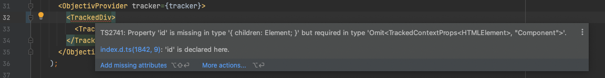
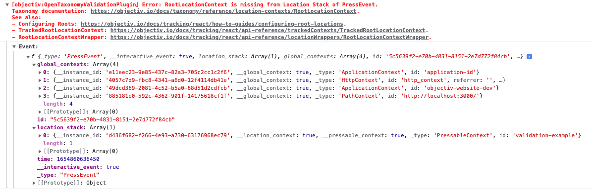
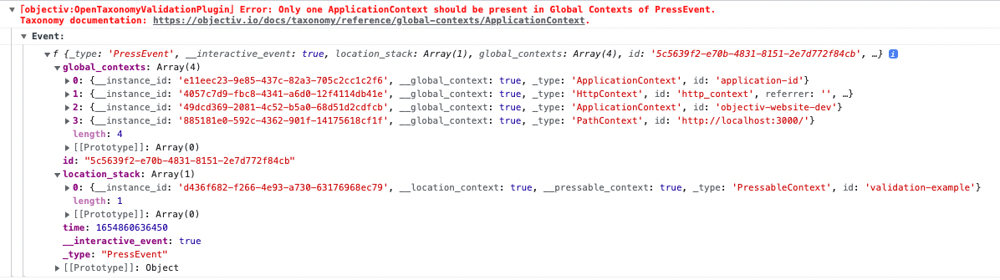

import useBaseUrl from '@docusaurus/useBaseUrl';

Data tracked by Objectiv adheres to the [open analytics taxonomy](/taxonomy/introduction.md). This means it 
can be validated early, at the first step of the pipeline. At the same time it makes instrumentation 
unambiguous and future-proof, as it largely prescribes how elements should be tracked. Next to this, the 
tracking SDKs provide helpful tooling to set up tracking instrumentation and catch any issues before data 
is collected.

## Build-time validation (in the IDE)
All Objectiv's functions come with TypeScript definitions.

During instrumentation, you'll get inline documentation for every function, and linting for any validation 
issues: unknown tagging/tracking calls, missing properties, or wrongly typed properties.

An example inline error in the IDE:


## Run-time validation
When you run your application, any **validation errors** are caught by the Objectiv debugger, and displayed 
in the browser console. Warnings are thrown for unknown tagging/tracking calls, missing properties, or 
wrongly typed properties.

### Developer Tools
If you also import the [`developer-tools`](https://www.npmjs.com/package/@objectiv/developer-tools) package,
you get added validation for:
* **Uniqueness**: Whether an Event `id` and its [Location Stack](locations.md) are unique.
* **Taxonomy**: The same validation the [Collector](/tracking/collector/introduction.md) does, client-side, 
  such as missing Contexts or malformed Location Stacks.
* **Links to contextually relevant documentation pages**: For example, if a required Context is missing for an 
  Event, the message will provide a link to that Context’s documentation, as well as any links to related 
  pages. The pages describe the intended use, and provide troubleshooting.

How to import the [`developer-tools`](https://www.npmjs.com/package/@objectiv/developer-tools) package depends 
on your application’s requirements (as an example, 
[see several options for React here](../react/how-to-guides/configuring-logging.md#enabling-developer-tools)), 
e.g. with conditional logic based on the environment, so you can choose not include the package in your 
production app to reduce build size:

```js
if (process.env.NODE_ENV.startsWith('dev')) {
  require('@objectiv/developer-tools');
}
```

When loaded, it will self-inject globally, and logging & validation will be enabled.

See two examples below. More validation rules are available, such as Location Contexts that are in the wrong 
position in the stack, and will be expanded, e.g. redundant Contexts, or duplicate Contexts.


#### Example: Missing RootLocationContext
In this example, the Tracker instance of the website has been configured to not track 
[RootLocationContexts](../../taxonomy/reference/location-contexts/RootLocationContext.md) from URLs, but no 
alternative has been implemented to generate those. Since 
[RootLocationContext](../../taxonomy/reference/location-contexts/RootLocationContext.md) is required by the 
open analytics taxonomy, this will result in the validation reporting the issue:



:::note

Note how the validation rules detected the platform we are running in, and attached links to the documentation 
for [React](../react/introduction.md) aimed at solving this particular type of validation error.

:::

#### Example: Duplicated ApplicationContext
In this second example, we simulate a low-level instrumentation gone wrong. The test button attempts to 
generate a custom [ApplicationContext](../../taxonomy/reference/global-contexts/ApplicationContext.md), but 
the Tracker has not been prevented from generating those automatically. Since 
[ApplicationContext](../../taxonomy/reference/global-contexts/ApplicationContext.md) should only be present 
once in the list of [Global Contexts](../../taxonomy/reference/global-contexts/overview.md), the validation 
reports the issue:



In this example we currently don't have any specific how-to links, but as we add more and more how-to's to 
our documentation, we may introduce them later on.

## Collector validation
As a final catch-all, Objectiv's [Collector](/tracking/collector/introduction.md) validates any incoming 
Event against the [open analytics taxonomy and its properties](/taxonomy/reference/events/overview.md), such 
as requiring a [RootLocationContext](../../taxonomy/reference/location-contexts/RootLocationContext.md) and 
[PathContext](../../taxonomy/reference/global-contexts/PathContext.md) for InteractiveEvents.

For more background, see the [Collector docs](/tracking/collector/introduction.md).
